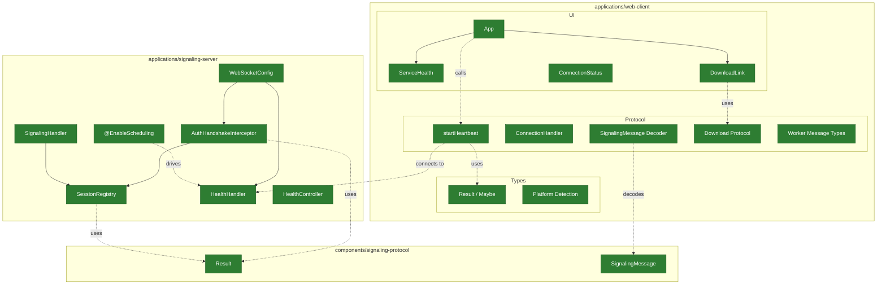
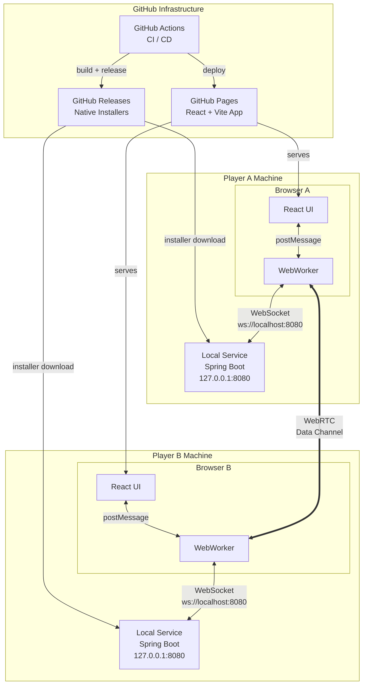
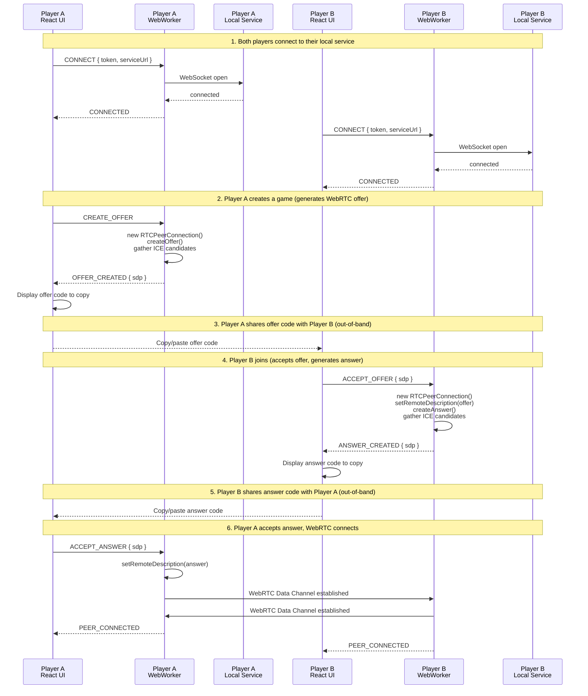
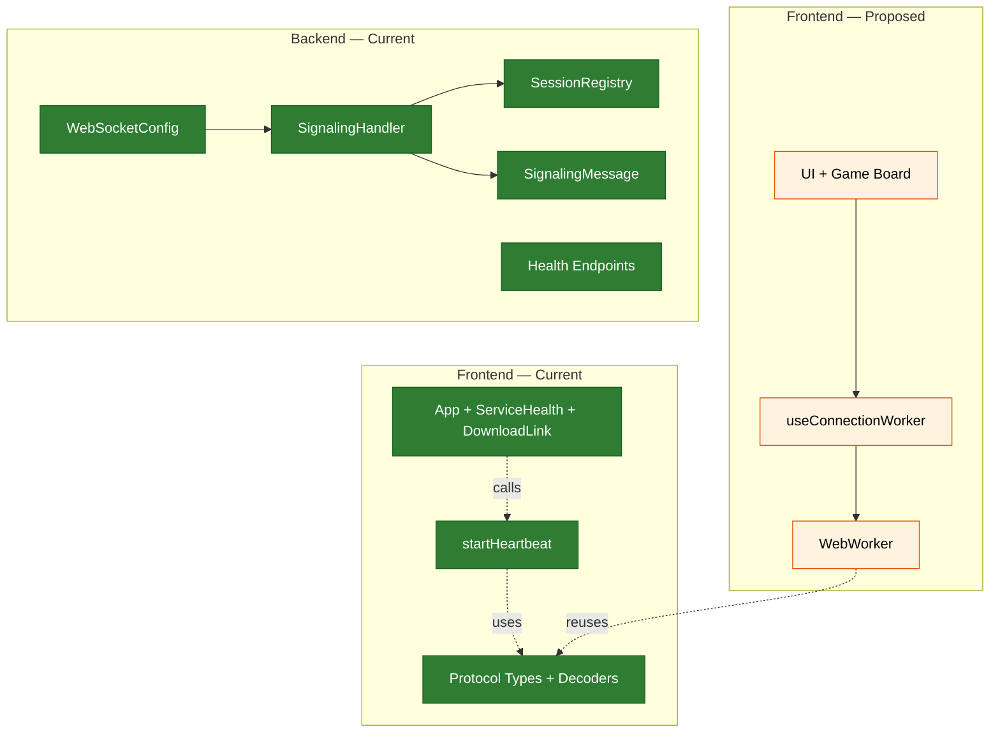
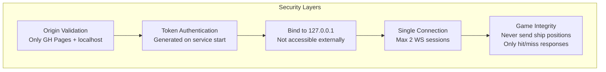

# Battleship P2P Platform — Architecture

## Current State

| Node | Description |
|------|-------------|
| HealthController | `GET /health` — HTTP readiness probe |
| HealthHandler | `WS /ws/health` — heartbeat every N ms |
| WebSocketConfig | Origin + token authentication |
| AuthHandshakeInterceptor | Result pipeline validation |
| SignalingHandler | Relay messages to peer |
| SessionRegistry | Max 2 WebSocket sessions |
| Result | `map` / `flatMap` / `or` / `either` / `mapEither` |
| SignalingMessage | Offer / Answer / ICE / Error |
| App | Lifts heartbeat state, derives download action |
| ServiceHealth | Display component — online / reconnecting / offline |
| DownloadLink | Download / Upgrade / hidden — GitHub API asset lookup |
| startHeartbeat | WebSocket state machine with reconnect + retry |
| ConnectionHandler | State machine / WebRTC |
| ConnectionStatus | UI component |
| Download Protocol | GitHub API + schemawax decoder |
| Worker Message Types | WorkerCommand / WorkerEvent |
| Result / Maybe | Frozen immutable types |
| Platform Detection | macOS / Windows / Linux |

> **Status (v0.3.0):** Backend signaling complete. Health endpoint serves both HTTP (readiness probes) and WebSocket heartbeat (live status). Frontend has heartbeat state machine with reconnect/retry, conditional Download/Upgrade link via GitHub API, platform detection, Result/Maybe types, schemawax decoders, connection handler, and ConnectionStatus component. ESLint enforces arrow functions, named exports. WebWorker thread and React hook not yet wired.
> Green = implemented and tested.

---

## Proposed Architecture

### System Overview

> **Differences from current state (v0.3.0):**
> - WebWorker bridges UI ↔ local service (currently App connects directly via startHeartbeat)
> - WebRTC data channel between players (not yet implemented)
> - Connection flow via signaling relay (signaling handler exists, not yet wired to frontend)

### Connection Flow

> **Differences from current state:** This entire flow is proposed. Currently the frontend connects to the heartbeat endpoint but does not yet establish signaling or WebRTC connections.

### Component Responsibilities

> Green = implemented. Orange = proposed / not yet built.

### Security

