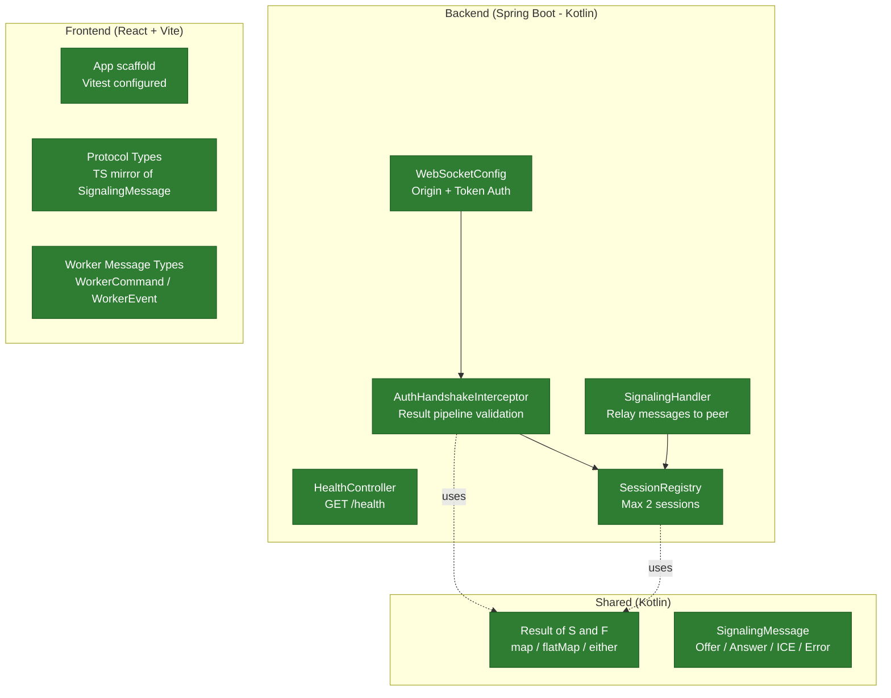
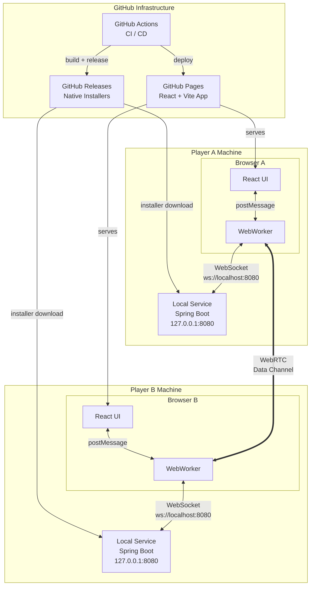
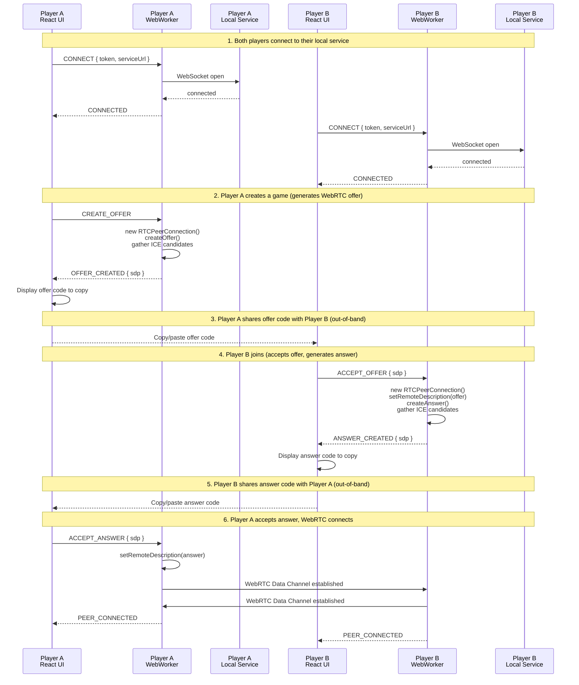
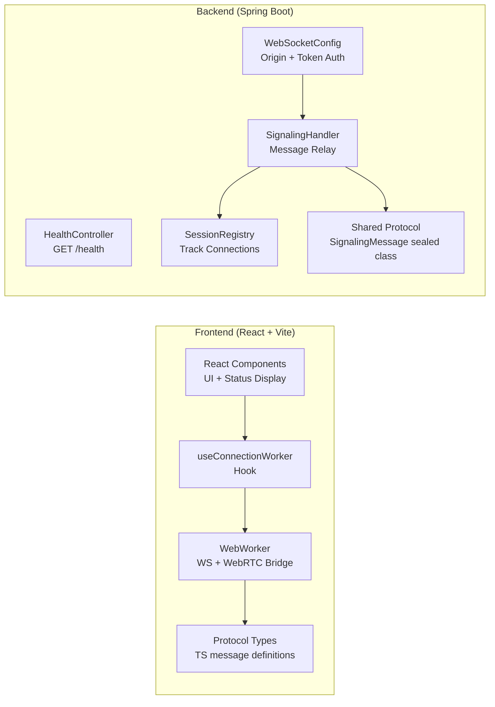
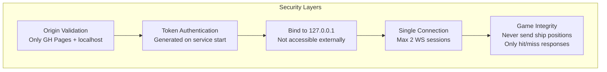

# Battleship P2P Platform — Architecture

## Current State

> **Status:** Backend signaling complete (Stories #1-5). Frontend scaffolded with type definitions. WebWorker and React UI not yet implemented.
> Green = implemented and tested.

---

## Proposed Architecture

### System Overview

### Connection Flow

### Component Responsibilities

### Security

