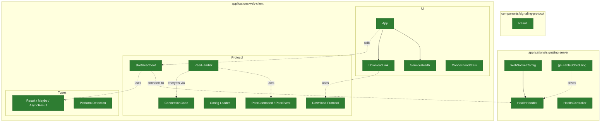
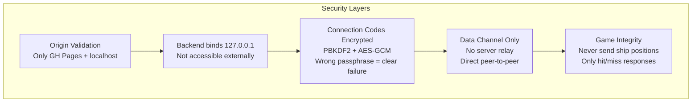

# Battleship P2P Platform — Architecture

## Current State



| Node | Description |
|------|-------------|
| HealthController | `GET /health` — HTTP readiness probe |
| HealthHandler | `WS /ws/health` — heartbeat every N ms |
| WebSocketConfig | Origin validation, registers health handler |
| Result | `map` / `andThen` / `or` / `either` / `mapEither` (Kotlin) |
| App | Loads runtime config, lifts heartbeat state, derives download action |
| ServiceHealth | Display component — online / reconnecting / offline |
| DownloadLink | Download / Upgrade / hidden — GitHub API asset lookup |
| startHeartbeat | WebSocket state machine with reconnect + retry |
| PeerHandler | Multi-peer WebRTC connection manager (`Map<peerId, RTCPeerConnection>`) |
| ConnectionCode | Compress (deflate-raw) + encrypt (PBKDF2 → AES-GCM) SDP to base64url codes |
| Config Loader | Fetches `config.json` at runtime (12-factor V) |
| ConnectionStatus | UI component (not yet wired) |
| Download Protocol | GitHub API + schemawax decoder |
| PeerCommand / PeerEvent | Typed message protocol with peer IDs |
| Result / Maybe / AsyncResult | Frozen immutable types (TypeScript) |
| Platform Detection | macOS / Windows / Linux |

> **Status (post Iteration 4):** Backend serves health endpoints only — signaling relay removed. Frontend has multi-peer WebRTC handler (identified connections via `crypto.randomUUID()`), encrypted connection codes (Web Crypto), heartbeat, download link, platform detection, runtime config loading. No UI for creating/joining connections yet.
> Green = implemented and tested.

---

## Connection Flow

```mermaid
sequenceDiagram
    participant A as Person A
    participant B as Person B

    Note over A, B: 1. Person A creates a connection

    A->>A: CREATE_OFFER
    A->>A: RTCPeerConnection + createDataChannel('game')
    A->>A: createOffer() → gather ICE → full SDP
    A->>A: compress + encrypt SDP with passphrase
    A-->>A: OFFER_CREATED { peerId, sdp }
    A->>A: Display connection code

    Note over A, B: 2. Person A shares code with Person B (out-of-band)

    A-->>B: Copy/paste connection code

    Note over A, B: 3. Person B joins (accepts offer, generates answer)

    B->>B: ACCEPT_OFFER { sdp }
    B->>B: decrypt + decompress code with passphrase
    B->>B: RTCPeerConnection + setRemoteDescription(offer)
    B->>B: createAnswer() → gather ICE → full SDP
    B->>B: compress + encrypt SDP with passphrase
    B-->>B: ANSWER_CREATED { peerId, sdp }
    B->>B: Display response code

    Note over A, B: 4. Person B shares response code with Person A (out-of-band)

    B-->>A: Copy/paste response code

    Note over A, B: 5. Person A accepts answer, data channel connects

    A->>A: ACCEPT_ANSWER { peerId, sdp }
    A->>A: decrypt + decompress code with passphrase
    A->>A: setRemoteDescription(answer)

    A<-->B: WebRTC Data Channel ('game') established

    A-->>A: PEER_CONNECTED { peerId }
    B-->>B: PEER_CONNECTED { peerId }
```

> **Key design decisions:**
> - No signaling server between peers — SDP exchanged via copy/paste (out-of-band)
> - ICE candidates fully gathered before surfacing SDP (no trickle ICE)
> - Connection codes compressed + encrypted with shared passphrase (PBKDF2 → AES-GCM)
> - Wrong passphrase produces a clear `DECRYPT_FAILED` error
> - Data channel `onopen`/`onclose` drives `PEER_CONNECTED`/`PEER_DISCONNECTED` (not ICE state)
> - Handler supports 0-to-many simultaneous connections, each identified by `peerId`

---

## Security


