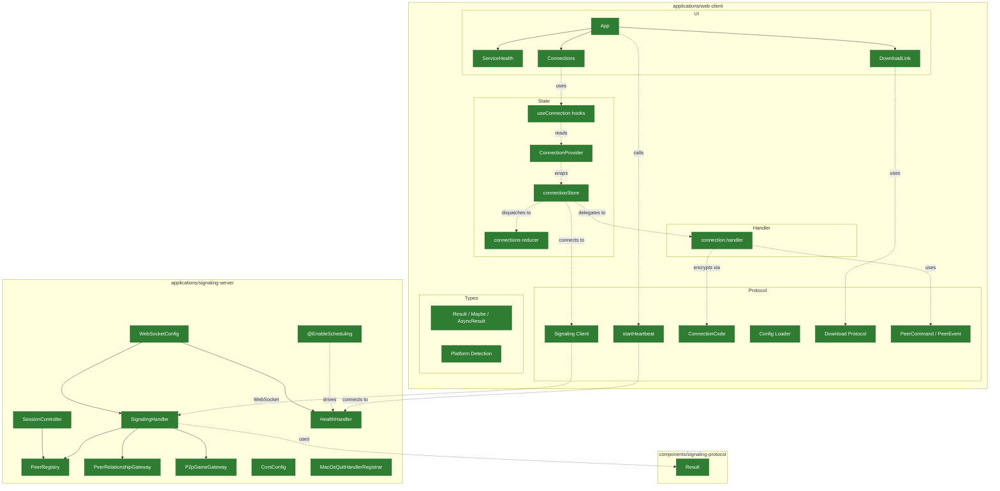
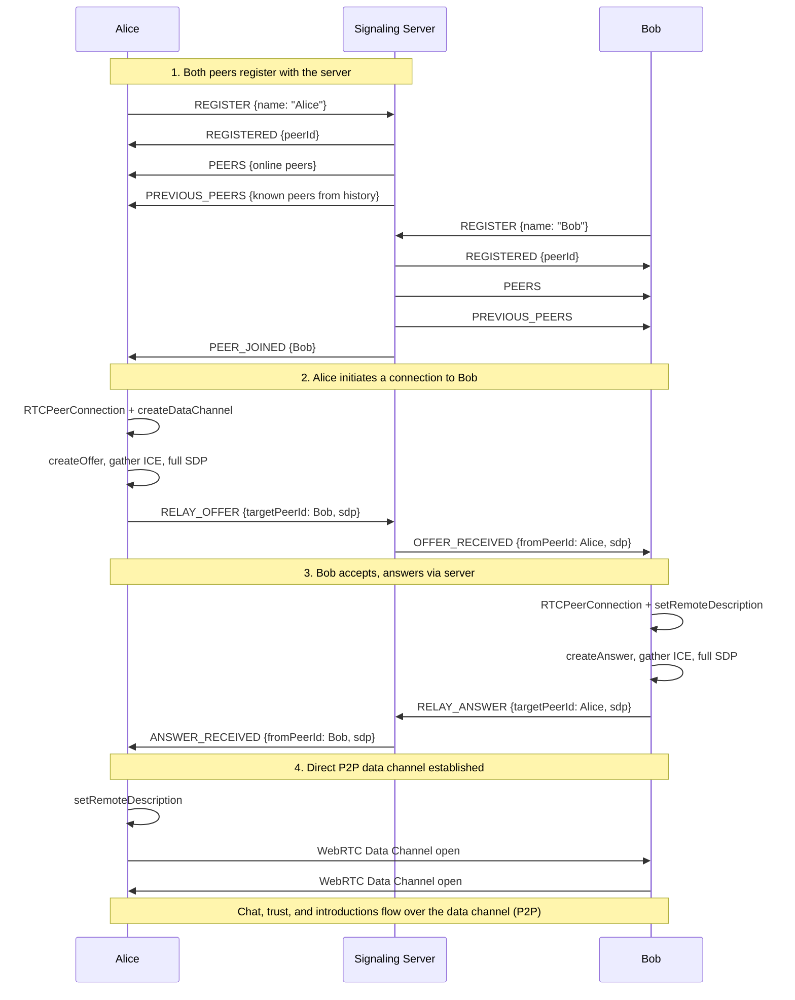
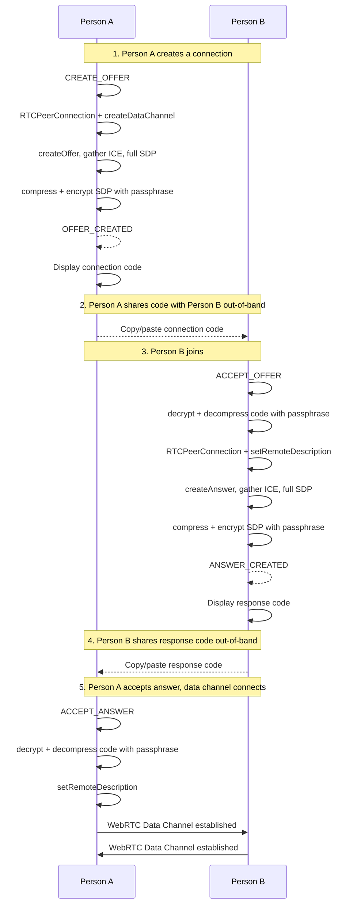
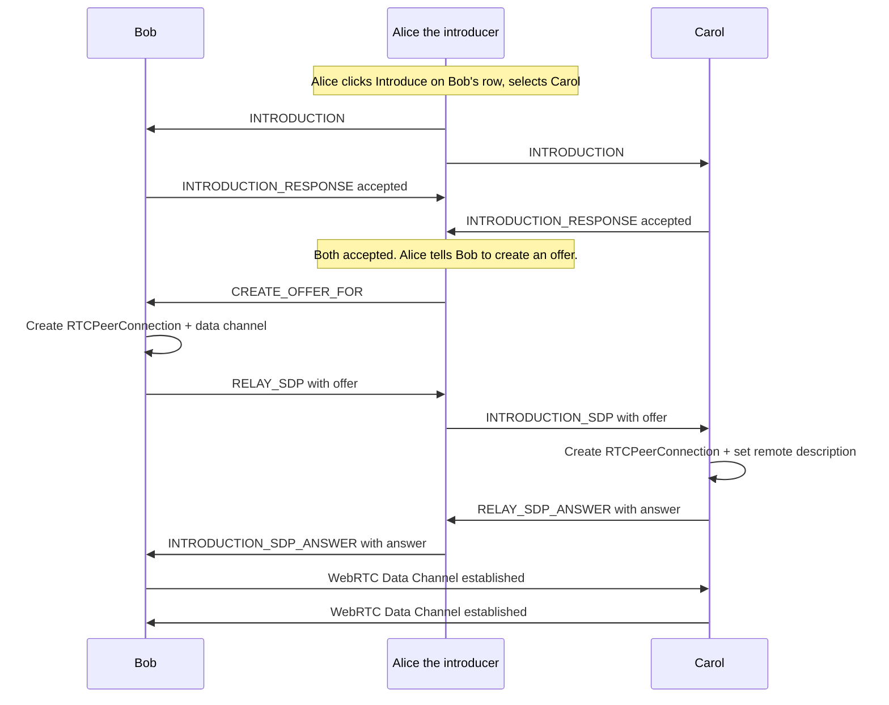
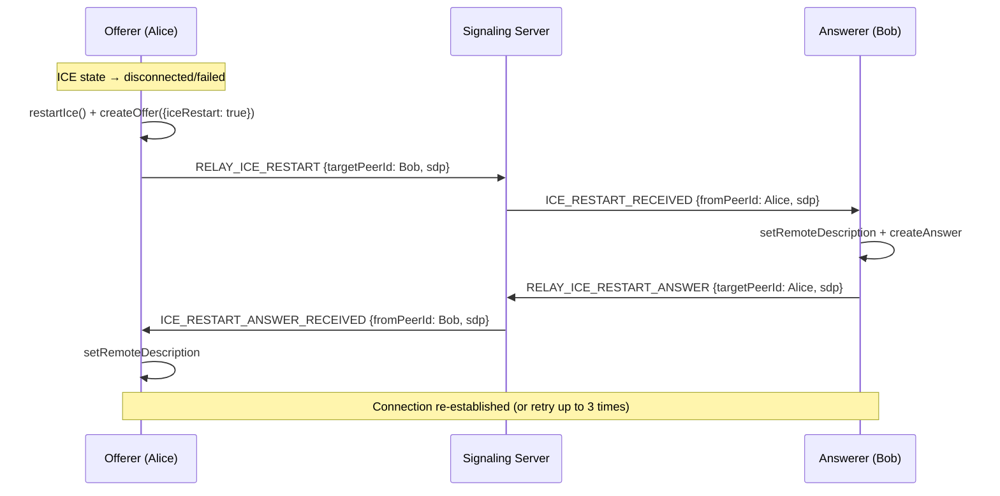
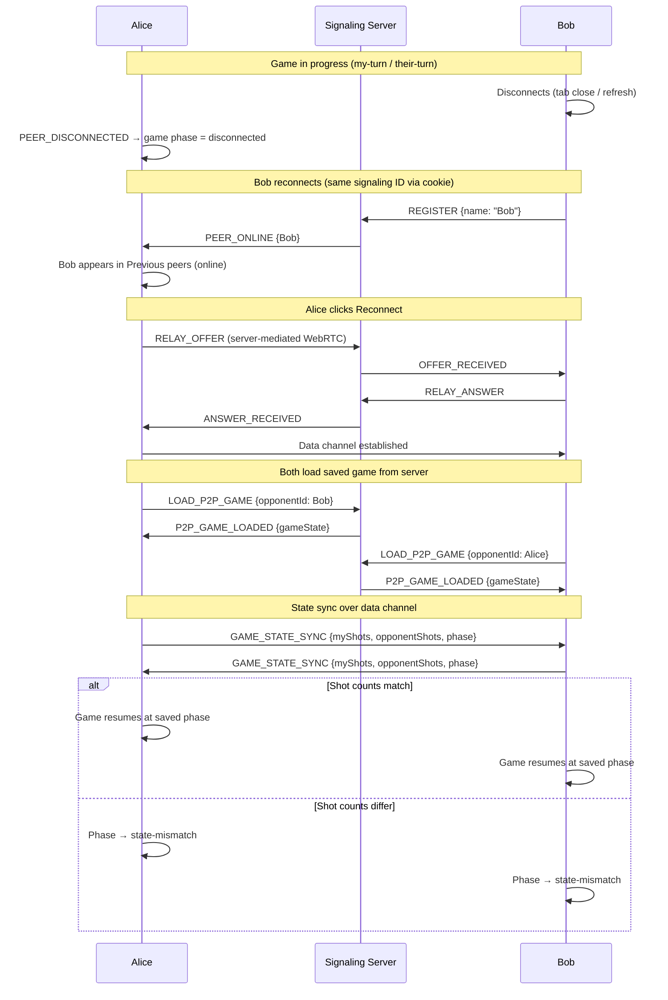
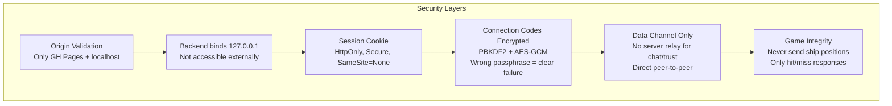

# Battleship P2P Platform — Architecture

## Current State

```mermaid
graph TB
    subgraph "applications/signaling-server"
        direction TB
        SC[SessionController] --> PR[PeerRegistry]
        WC[WebSocketConfig] --> SH[SignalingHandler]
        WC --> HH[HealthHandler]
        SH --> PR
        SH --> PRG[PeerRelationshipGateway]
        SH --> PGG[P2pGameGateway]
        ES["@EnableScheduling"] -.->|drives| HH
        CC[CorsConfig]
        QH[MacOsQuitHandlerRegistrar]
    end

    subgraph "components/signaling-protocol"
        RT[Result]
    end

    subgraph "applications/web-client"
        direction TB
        subgraph "UI"
            APP[App] --> SHC[ServiceHealth]
            APP --> DL[DownloadLink]
            APP --> CONN[Connections]
        end
        subgraph "State"
            CP[ConnectionProvider]
            CST[connectionStore]
            RED[connections reducer]
            UCH[useConnection hooks]
        end
        subgraph "Protocol"
            SIG[Signaling Client]
            HB[startHeartbeat]
            COD[ConnectionCode]
            CFG[Config Loader]
            DLProto[Download Protocol]
            WT[PeerCommand / PeerEvent]
        end
        subgraph "Handler"
            PH[connection.handler]
        end
        subgraph "Types"
            RS[Result / Maybe / AsyncResult]
            PL[Platform Detection]
        end
    end

    APP -.->|calls| HB
    HB -.->|connects to| HH
    DL -.->|uses| DLProto
    CONN -.->|uses| UCH
    UCH -.->|reads| CP
    CP -.->|wraps| CST
    CST -.->|dispatches to| RED
    CST -.->|delegates to| PH
    CST -.->|connects to| SIG
    SIG -.->|WebSocket| SH
    PH -.->|uses| WT
    PH -.->|encrypts via| COD
    SH -.->|uses| RT

    style SC fill:#2e7d32,stroke:#1b5e20,color:#fff
    style SH fill:#2e7d32,stroke:#1b5e20,color:#fff
    style PR fill:#2e7d32,stroke:#1b5e20,color:#fff
    style PRG fill:#2e7d32,stroke:#1b5e20,color:#fff
    style PGG fill:#2e7d32,stroke:#1b5e20,color:#fff
    style HH fill:#2e7d32,stroke:#1b5e20,color:#fff
    style WC fill:#2e7d32,stroke:#1b5e20,color:#fff
    style ES fill:#2e7d32,stroke:#1b5e20,color:#fff
    style CC fill:#2e7d32,stroke:#1b5e20,color:#fff
    style QH fill:#2e7d32,stroke:#1b5e20,color:#fff
    style RT fill:#2e7d32,stroke:#1b5e20,color:#fff
    style APP fill:#2e7d32,stroke:#1b5e20,color:#fff
    style SHC fill:#2e7d32,stroke:#1b5e20,color:#fff
    style DL fill:#2e7d32,stroke:#1b5e20,color:#fff
    style CONN fill:#2e7d32,stroke:#1b5e20,color:#fff
    style CP fill:#2e7d32,stroke:#1b5e20,color:#fff
    style CST fill:#2e7d32,stroke:#1b5e20,color:#fff
    style RED fill:#2e7d32,stroke:#1b5e20,color:#fff
    style UCH fill:#2e7d32,stroke:#1b5e20,color:#fff
    style SIG fill:#2e7d32,stroke:#1b5e20,color:#fff
    style HB fill:#2e7d32,stroke:#1b5e20,color:#fff
    style RS fill:#2e7d32,stroke:#1b5e20,color:#fff
    style PH fill:#2e7d32,stroke:#1b5e20,color:#fff
    style COD fill:#2e7d32,stroke:#1b5e20,color:#fff
    style CFG fill:#2e7d32,stroke:#1b5e20,color:#fff
    style WT fill:#2e7d32,stroke:#1b5e20,color:#fff
    style PL fill:#2e7d32,stroke:#1b5e20,color:#fff
    style DLProto fill:#2e7d32,stroke:#1b5e20,color:#fff
```

| Node | Description |
|------|-------------|
| SessionController | `GET /session` — assigns persistent `peerId` cookie |
| SignalingHandler | `WS /ws/signaling` — routes 12 message types for peer discovery, SDP relay, email sharing, game save/load |
| PeerRegistry | In-memory peer-to-session map with relationship persistence |
| PeerRelationshipGateway | JPA interface — 6 entities: relationships, names, emails, sharing permissions, forgotten pairs, saved emails |
| P2pGameGateway | JPA interface — persists P2P game state keyed by sorted peer-ID pair for reconnect resume |
| HealthHandler | `WS /ws/health` — heartbeat every N ms with version |
| WebSocketConfig | Origin validation, registers signaling + health handlers, peerId interceptor |
| CorsConfig | Global CORS — configured origins, credentials enabled |
| MacOsQuitHandlerRegistrar | Listens for macOS dock quit, gracefully closes Spring context |
| Result | `map` / `andThen` / `or` / `either` / `mapEither` / `tryCatch` (Kotlin) |
| App | Loads runtime config, lifts heartbeat state, derives download action |
| ServiceHealth | Display component — online / reconnecting / offline |
| DownloadLink | Download / Upgrade / hidden — GitHub API asset lookup |
| Connections | Peer list with connect, trust, introduce, disconnect, chat |
| ConnectionProvider | React context provider wrapping connectionStore |
| connectionStore | Custom store — middleware, listener factories, dispatches to reducer and handler |
| connections reducer | Pure reducer — peers, flow, messages, introductions, online/previous peers, ICE health |
| useConnection hooks | `useConnectionStore()` and `useConnectionState(selector)` for components |
| Signaling Client | WebSocket client for `/ws/signaling` — decodes server events, sends commands |
| startHeartbeat | WebSocket state machine with reconnect + retry |
| connection.handler | Multi-peer WebRTC manager — RTCPeerConnection, data channels, trust, introductions, chat, ICE restart, P2P game protocol (challenge, shots, coin flip, state sync) |
| ConnectionCode | Compress (deflate-raw) + encrypt (PBKDF2 → AES-GCM) SDP to base64url codes |
| Config Loader | Fetches `config.json` at runtime (12-factor V) |
| Download Protocol | GitHub API + schemawax decoder |
| PeerCommand / PeerEvent | Typed message protocol — 14 commands, 16 events |
| Result / Maybe / AsyncResult | Frozen immutable types (TypeScript) |
| Platform Detection | macOS / Windows / Linux |

> **Status (post Iteration 7):** Backend provides full signaling relay (peer discovery, SDP exchange, ICE restart relay, email sharing, game save/load) with H2 persistence for peer relationships and game state. Frontend has complete P2P connection management: server-mediated WebRTC negotiation, multi-peer data channels, trust model, peer introductions, real-time chat, ICE restart resilience, and game resume after disconnection. Native installers (dmg, msi, deb) with macOS dock quit support.
> Green = implemented and tested.

---

## Server-Mediated Connection Flow

```mermaid
sequenceDiagram
    participant A as Alice
    participant S as Signaling Server
    participant B as Bob

    Note over A, S: 1. Both peers register with the server

    A->>S: REGISTER {name: "Alice"}
    S->>A: REGISTERED {peerId}
    S->>A: PEERS {online peers}
    S->>A: PREVIOUS_PEERS {known peers from history}

    B->>S: REGISTER {name: "Bob"}
    S->>B: REGISTERED {peerId}
    S->>B: PEERS
    S->>B: PREVIOUS_PEERS
    S->>A: PEER_JOINED {Bob}

    Note over A, B: 2. Alice initiates a connection to Bob

    A->>A: RTCPeerConnection + createDataChannel
    A->>A: createOffer, gather ICE, full SDP
    A->>S: RELAY_OFFER {targetPeerId: Bob, sdp}
    S->>B: OFFER_RECEIVED {fromPeerId: Alice, sdp}

    Note over A, B: 3. Bob accepts, answers via server

    B->>B: RTCPeerConnection + setRemoteDescription
    B->>B: createAnswer, gather ICE, full SDP
    B->>S: RELAY_ANSWER {targetPeerId: Alice, sdp}
    S->>A: ANSWER_RECEIVED {fromPeerId: Bob, sdp}

    Note over A, B: 4. Direct P2P data channel established

    A->>A: setRemoteDescription
    A->>B: WebRTC Data Channel open
    B->>A: WebRTC Data Channel open

    Note over A, B: Chat, trust, and introductions flow over the data channel (P2P)
```

> **Key design decisions:**
> - Signaling server relays SDP but never sees the data channel traffic
> - ICE candidates fully gathered before surfacing SDP (no trickle ICE)
> - Server persists peer relationships so previously-connected peers appear on reconnect
> - Data channel `onopen`/`onclose` drives `PEER_CONNECTED`/`PEER_DISCONNECTED` (not ICE state)
> - Handler supports 0-to-many simultaneous connections, each identified by `peerId`

---

## Direct Connection Flow (Copy/Paste)

```mermaid
sequenceDiagram
    participant A as Person A
    participant B as Person B

    Note over A, B: 1. Person A creates a connection

    A->>A: CREATE_OFFER
    A->>A: RTCPeerConnection + createDataChannel
    A->>A: createOffer, gather ICE, full SDP
    A->>A: compress + encrypt SDP with passphrase
    A-->>A: OFFER_CREATED
    A->>A: Display connection code

    Note over A, B: 2. Person A shares code with Person B out-of-band

    A-->>B: Copy/paste connection code

    Note over A, B: 3. Person B joins

    B->>B: ACCEPT_OFFER
    B->>B: decrypt + decompress code with passphrase
    B->>B: RTCPeerConnection + setRemoteDescription
    B->>B: createAnswer, gather ICE, full SDP
    B->>B: compress + encrypt SDP with passphrase
    B-->>B: ANSWER_CREATED
    B->>B: Display response code

    Note over A, B: 4. Person B shares response code out-of-band

    B-->>A: Copy/paste response code

    Note over A, B: 5. Person A accepts answer, data channel connects

    A->>A: ACCEPT_ANSWER
    A->>A: decrypt + decompress code with passphrase
    A->>A: setRemoteDescription

    A->>B: WebRTC Data Channel established
    B->>A: WebRTC Data Channel established
```

> **Key design decisions:**
> - No signaling server needed — SDP exchanged via copy/paste (out-of-band)
> - Connection codes compressed + encrypted with shared passphrase (PBKDF2 → AES-GCM)
> - Wrong passphrase produces a clear `DECRYPT_FAILED` error

---

## Introduction Flow

When Alice is connected to both Bob and Carol, and both trust her, she can introduce them so they connect directly without exchanging codes.

```mermaid
sequenceDiagram
    participant B as Bob
    participant A as Alice the introducer
    participant C as Carol

    Note over A: Alice clicks Introduce on Bob's row, selects Carol

    A->>B: INTRODUCTION
    A->>C: INTRODUCTION

    B->>A: INTRODUCTION_RESPONSE accepted
    C->>A: INTRODUCTION_RESPONSE accepted

    Note over A: Both accepted. Alice tells Bob to create an offer.

    A->>B: CREATE_OFFER_FOR
    B->>B: Create RTCPeerConnection + data channel
    B->>A: RELAY_SDP with offer
    A->>C: INTRODUCTION_SDP with offer
    C->>C: Create RTCPeerConnection + set remote description
    C->>A: RELAY_SDP_ANSWER with answer
    A->>B: INTRODUCTION_SDP_ANSWER with answer

    B->>C: WebRTC Data Channel established
    C->>B: WebRTC Data Channel established
```

> **Key design decisions:**
> - Alice relays SDP between Bob and Carol through existing data channels (no server)
> - Both parties must explicitly accept before SDP exchange begins
> - Decline by either party notifies the other via `INTRODUCTION_DECLINED`
> - 60-second timeout sends `INTRODUCTION_EXPIRED` to both parties
> - Disconnecting during a pending introduction auto-declines
> - Introduction-created PeerConnections are cleaned up on cancel/decline/expire

---

## ICE Restart Flow

When an established connection becomes unstable (ICE state `disconnected` or `failed`), the offerer automatically attempts recovery.

```mermaid
sequenceDiagram
    participant A as Offerer (Alice)
    participant S as Signaling Server
    participant B as Answerer (Bob)

    Note over A: ICE state → disconnected/failed

    A->>A: restartIce() + createOffer({iceRestart: true})
    A->>S: RELAY_ICE_RESTART {targetPeerId: Bob, sdp}
    S->>B: ICE_RESTART_RECEIVED {fromPeerId: Alice, sdp}
    B->>B: setRemoteDescription + createAnswer
    B->>S: RELAY_ICE_RESTART_ANSWER {targetPeerId: Alice, sdp}
    S->>A: ICE_RESTART_ANSWER_RECEIVED {fromPeerId: Bob, sdp}
    A->>A: setRemoteDescription

    Note over A, B: Connection re-established (or retry up to 3 times)
```

> **Key design decisions:**
> - Only the offerer initiates ICE restart (avoids glare)
> - Up to 3 automatic retries before giving up with `PEER_DISCONNECTED`
> - ICE restart SDP relayed through the signaling server (data channel may be broken)
> - `peerConnectionHealth` state tracks `stable` / `unstable` per peer

---

## Game Reconnect Flow

When a peer disconnects mid-game (tab close, page refresh, network drop), the game transitions to `disconnected` phase. On reconnect, both peers load saved game state from the server and verify consistency before resuming.

```mermaid
sequenceDiagram
    participant A as Alice
    participant S as Signaling Server
    participant B as Bob

    Note over A, B: Game in progress (my-turn / their-turn)

    B->>B: Disconnects (tab close / refresh)
    A->>A: PEER_DISCONNECTED → game phase = disconnected

    Note over A, B: Bob reconnects (same signaling ID via cookie)

    B->>S: REGISTER {name: "Bob"}
    S->>A: PEER_ONLINE {Bob}
    A->>A: Bob appears in Previous peers (online)

    Note over A, B: Alice clicks Reconnect

    A->>S: RELAY_OFFER (server-mediated WebRTC)
    S->>B: OFFER_RECEIVED
    B->>S: RELAY_ANSWER
    S->>A: ANSWER_RECEIVED
    A->>B: Data channel established

    Note over A, B: Both load saved game from server

    A->>S: LOAD_P2P_GAME {opponentId: Bob}
    S->>A: P2P_GAME_LOADED {gameState}
    B->>S: LOAD_P2P_GAME {opponentId: Alice}
    S->>B: P2P_GAME_LOADED {gameState}

    Note over A, B: State sync over data channel

    A->>B: GAME_STATE_SYNC {myShots, opponentShots, phase}
    B->>A: GAME_STATE_SYNC {myShots, opponentShots, phase}

    alt Shot counts match
        A->>A: Game resumes at saved phase
        B->>B: Game resumes at saved phase
    else Shot counts differ
        A->>A: Phase → state-mismatch
        B->>B: Phase → state-mismatch
    end
```

> **Key design decisions:**
> - Game state auto-saved to server on turn transitions (`TURN_ORDER_DECIDED`, `P2P_FIRE_RESULT`, `OPPONENT_FIRED`, `P2P_GAME_OVER`)
> - Server stores game keyed by sorted signaling-peer-ID pair (symmetrical lookup)
> - `loadP2pGame` dispatched on every `PEER_CONNECTED` (server returns NOT_FOUND if no game — harmless)
> - Signaling-to-local peer ID mapping resolves stale opponent IDs across reconnection
> - `GAME_STATE_SYNC` sent once on game load (not echoed back) to avoid infinite loops
> - Only server-mediated connections create signaling ID mappings; direct code-exchange connections cannot resume games

---

## Security

```mermaid
graph TD
    subgraph "Security Layers"
        O[Origin Validation<br/>Only GH Pages + localhost]
        B[Backend binds 127.0.0.1<br/>Not accessible externally]
        S[Session Cookie<br/>HttpOnly, Secure, SameSite=None]
        E[Connection Codes Encrypted<br/>PBKDF2 + AES-GCM<br/>Wrong passphrase = clear failure]
        D[Data Channel Only<br/>No server relay for chat/trust<br/>Direct peer-to-peer]
        G[Game Integrity<br/>Never send ship positions<br/>Only hit/miss responses]
    end

    O --> B --> S --> E --> D --> G
```
