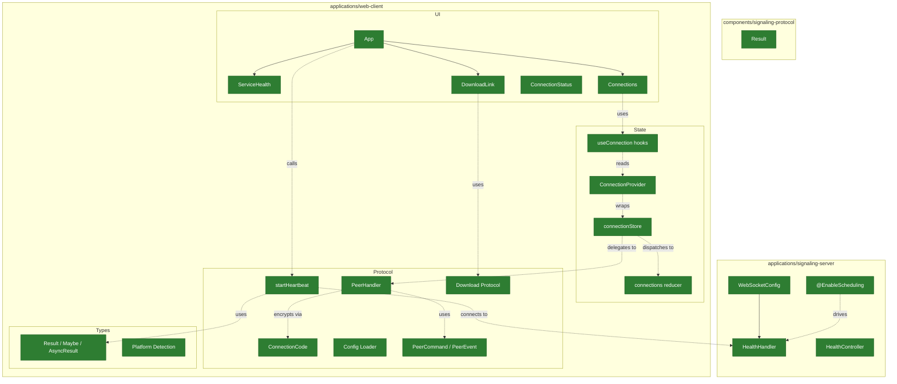
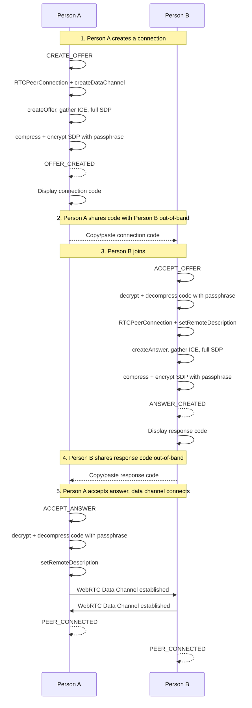
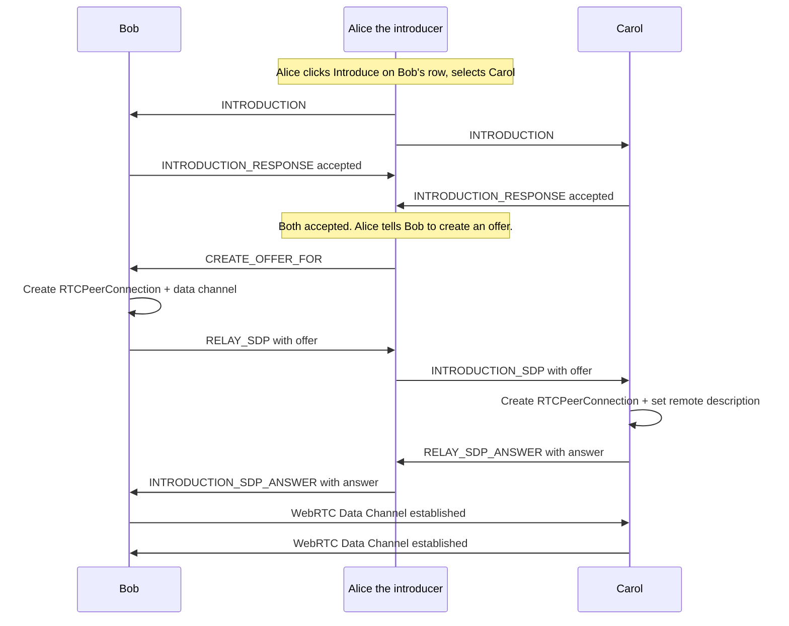
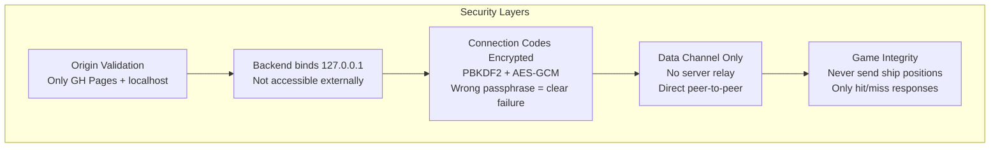

# Battleship P2P Platform — Architecture

## Current State

```mermaid
graph TB
    subgraph "applications/signaling-server"
        direction TB
        WC[WebSocketConfig] --> HH[HealthHandler]
        ES["@EnableScheduling"] -.->|drives| HH
        HC[HealthController]
    end

    subgraph "components/signaling-protocol"
        RT[Result]
    end

    subgraph "applications/web-client"
        direction TB
        subgraph "UI"
            APP[App] --> SHC[ServiceHealth]
            APP --> DL[DownloadLink]
            APP --> CONN[Connections]
            CS[ConnectionStatus]
        end
        subgraph "State"
            CP[ConnectionProvider]
            CST[connectionStore]
            RED[connections reducer]
            UCH[useConnection hooks]
        end
        subgraph "Protocol"
            HB[startHeartbeat]
            PH[PeerHandler]
            CC[ConnectionCode]
            CFG[Config Loader]
            DLProto[Download Protocol]
            WT[PeerCommand / PeerEvent]
        end
        subgraph "Types"
            RS[Result / Maybe / AsyncResult]
            PL[Platform Detection]
        end
    end

    APP -.->|calls| HB
    HB -.->|connects to| HH
    DL -.->|uses| DLProto
    HB -.->|uses| RS
    CONN -.->|uses| UCH
    UCH -.->|reads| CP
    CP -.->|wraps| CST
    CST -.->|dispatches to| RED
    CST -.->|delegates to| PH
    PH -.->|uses| WT
    PH -.->|encrypts via| CC

    style HC fill:#2e7d32,stroke:#1b5e20,color:#fff
    style HH fill:#2e7d32,stroke:#1b5e20,color:#fff
    style WC fill:#2e7d32,stroke:#1b5e20,color:#fff
    style ES fill:#2e7d32,stroke:#1b5e20,color:#fff
    style RT fill:#2e7d32,stroke:#1b5e20,color:#fff
    style APP fill:#2e7d32,stroke:#1b5e20,color:#fff
    style SHC fill:#2e7d32,stroke:#1b5e20,color:#fff
    style DL fill:#2e7d32,stroke:#1b5e20,color:#fff
    style CONN fill:#2e7d32,stroke:#1b5e20,color:#fff
    style CP fill:#2e7d32,stroke:#1b5e20,color:#fff
    style CST fill:#2e7d32,stroke:#1b5e20,color:#fff
    style RED fill:#2e7d32,stroke:#1b5e20,color:#fff
    style UCH fill:#2e7d32,stroke:#1b5e20,color:#fff
    style HB fill:#2e7d32,stroke:#1b5e20,color:#fff
    style RS fill:#2e7d32,stroke:#1b5e20,color:#fff
    style PH fill:#2e7d32,stroke:#1b5e20,color:#fff
    style CC fill:#2e7d32,stroke:#1b5e20,color:#fff
    style CFG fill:#2e7d32,stroke:#1b5e20,color:#fff
    style CS fill:#2e7d32,stroke:#1b5e20,color:#fff
    style WT fill:#2e7d32,stroke:#1b5e20,color:#fff
    style PL fill:#2e7d32,stroke:#1b5e20,color:#fff
    style DLProto fill:#2e7d32,stroke:#1b5e20,color:#fff
```

| Node | Description |
|------|-------------|
| HealthController | `GET /health` — HTTP readiness probe |
| HealthHandler | `WS /ws/health` — heartbeat every N ms |
| WebSocketConfig | Origin validation, registers health handler |
| Result | `map` / `andThen` / `or` / `either` / `mapEither` (Kotlin) |
| App | Loads runtime config, lifts heartbeat state, derives download action |
| ServiceHealth | Display component — online / reconnecting / offline |
| DownloadLink | Download / Upgrade / hidden — GitHub API asset lookup |
| Connections | Create/join offers, peer list with trust/introduce/disconnect, pending introductions |
| ConnectionProvider | React context provider wrapping connectionStore |
| connectionStore | Zustand-style store — delegates commands to PeerHandler, exposes state |
| connections reducer | Pure reducer — peers, flow, pending introductions |
| useConnection hooks | `useConnectionStore()` and `useConnectionState(selector)` for components |
| startHeartbeat | WebSocket state machine with reconnect + retry |
| PeerHandler | Multi-peer WebRTC manager — connections, data channels, trust, introductions with SDP relay |
| ConnectionCode | Compress (deflate-raw) + encrypt (PBKDF2 → AES-GCM) SDP to base64url codes |
| Config Loader | Fetches `config.json` at runtime (12-factor V) |
| ConnectionStatus | UI component (not yet wired) |
| Download Protocol | GitHub API + schemawax decoder |
| PeerCommand / PeerEvent | Typed message protocol with peer IDs |
| Result / Maybe / AsyncResult | Frozen immutable types (TypeScript) |
| Platform Detection | macOS / Windows / Linux |

> **Status (post Iteration 4):** Backend serves health endpoints only — signaling relay removed. Frontend has full P2P connection management: multi-peer WebRTC handler, encrypted connection codes (Web Crypto), trust model (grant/revoke per peer), peer introductions with SDP relay through a mutual trusted peer, resource cleanup on cancel/decline/expire/disconnect. UI includes create/join flow, peer list with trust/introduce/disconnect controls, and pending introduction notifications. State managed via context provider, store, and pure reducer with React hooks.
> Green = implemented and tested.

---

## Connection Flow

```mermaid
sequenceDiagram
    participant A as Person A
    participant B as Person B

    Note over A, B: 1. Person A creates a connection

    A->>A: CREATE_OFFER
    A->>A: RTCPeerConnection + createDataChannel
    A->>A: createOffer, gather ICE, full SDP
    A->>A: compress + encrypt SDP with passphrase
    A-->>A: OFFER_CREATED
    A->>A: Display connection code

    Note over A, B: 2. Person A shares code with Person B out-of-band

    A-->>B: Copy/paste connection code

    Note over A, B: 3. Person B joins

    B->>B: ACCEPT_OFFER
    B->>B: decrypt + decompress code with passphrase
    B->>B: RTCPeerConnection + setRemoteDescription
    B->>B: createAnswer, gather ICE, full SDP
    B->>B: compress + encrypt SDP with passphrase
    B-->>B: ANSWER_CREATED
    B->>B: Display response code

    Note over A, B: 4. Person B shares response code out-of-band

    B-->>A: Copy/paste response code

    Note over A, B: 5. Person A accepts answer, data channel connects

    A->>A: ACCEPT_ANSWER
    A->>A: decrypt + decompress code with passphrase
    A->>A: setRemoteDescription

    A->>B: WebRTC Data Channel established
    B->>A: WebRTC Data Channel established

    A-->>A: PEER_CONNECTED
    B-->>B: PEER_CONNECTED
```

> **Key design decisions:**
> - No signaling server between peers — SDP exchanged via copy/paste (out-of-band)
> - ICE candidates fully gathered before surfacing SDP (no trickle ICE)
> - Connection codes compressed + encrypted with shared passphrase (PBKDF2 → AES-GCM)
> - Wrong passphrase produces a clear `DECRYPT_FAILED` error
> - Data channel `onopen`/`onclose` drives `PEER_CONNECTED`/`PEER_DISCONNECTED` (not ICE state)
> - Handler supports 0-to-many simultaneous connections, each identified by `peerId`

---

## Introduction Flow

When Alice is connected to both Bob and Carol, and both trust her, she can introduce them so they connect directly without exchanging codes.

```mermaid
sequenceDiagram
    participant B as Bob
    participant A as Alice the introducer
    participant C as Carol

    Note over A: Alice clicks Introduce on Bob's row, selects Carol

    A->>B: INTRODUCTION
    A->>C: INTRODUCTION

    B->>A: INTRODUCTION_RESPONSE accepted
    C->>A: INTRODUCTION_RESPONSE accepted

    Note over A: Both accepted. Alice tells Bob to create an offer.

    A->>B: CREATE_OFFER_FOR
    B->>B: Create RTCPeerConnection + data channel
    B->>A: RELAY_SDP with offer
    A->>C: INTRODUCTION_SDP with offer
    C->>C: Create RTCPeerConnection + set remote description
    C->>A: RELAY_SDP_ANSWER with answer
    A->>B: INTRODUCTION_SDP_ANSWER with answer

    B->>C: WebRTC Data Channel established
    C->>B: WebRTC Data Channel established
```

> **Key design decisions:**
> - Alice relays SDP between Bob and Carol through existing data channels (no server)
> - Both parties must explicitly accept before SDP exchange begins
> - Decline by either party notifies the other via `INTRODUCTION_DECLINED`
> - 60-second timeout sends `INTRODUCTION_EXPIRED` to both parties
> - Disconnecting during a pending introduction auto-declines
> - Introduction-created PeerConnections are cleaned up on cancel/decline/expire

---

## Security

```mermaid
graph TD
    subgraph "Security Layers"
        O[Origin Validation<br/>Only GH Pages + localhost]
        B[Backend binds 127.0.0.1<br/>Not accessible externally]
        E[Connection Codes Encrypted<br/>PBKDF2 + AES-GCM<br/>Wrong passphrase = clear failure]
        D[Data Channel Only<br/>No server relay<br/>Direct peer-to-peer]
        G[Game Integrity<br/>Never send ship positions<br/>Only hit/miss responses]
    end

    O --> B --> E --> D --> G
```
